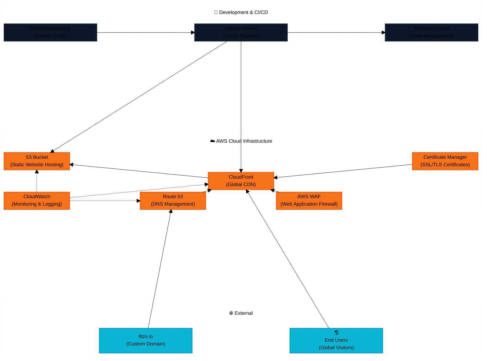

# DevOps Portfolio Website

[](https://github.com/VanSteve/portfolio/actions/workflows/deploy-prod.yml)
[](https://github.com/VanSteve/portfolio/actions/workflows/deploy-staging.yml)
[](https://github.com/VanSteve/portfolio/actions/workflows/security.yml)

A modern, cloud-native portfolio website built to demonstrate DevOps engineering expertise. This project showcases best practices in cloud infrastructure, Infrastructure as Code (IaC), CI/CD automation, security, and observability.

**🌐 Live Site**: [fitzs.io](https://fitzs.io)

## 🏗️ Architecture Overview



## 🚀 Tech Stack

### Infrastructure & Cloud
- **Cloud Provider**: Amazon Web Services (AWS)
- **Infrastructure as Code**: Terraform with Terraform Cloud
- **CDN**: Amazon CloudFront
- **Storage**: Amazon S3
- **DNS**: Amazon Route 53
- **Security**: AWS WAF, AWS Certificate Manager
- **Monitoring**: Amazon CloudWatch

### DevOps & Automation
- **CI/CD**: GitHub Actions
- **Version Control**: Git with GitHub
- **Container Registry**: GitHub Container Registry
- **Secrets Management**: GitHub Secrets
- **State Management**: Terraform Cloud

### Development & Frontend
- **Framework**: [To be determined - React/Vue/Static]
- **Build Tool**: [To be determined - Vite/Webpack/Parcel]
- **Testing**: [To be determined - Jest/Cypress]
- **Linting**: ESLint, Prettier
- **Security Scanning**: CodeQL, npm audit

## 📁 Project Structure

```
portfolio/
├── .github/
│   ├── workflows/           # GitHub Actions CI/CD pipelines
│   │   ├── pr.yml          # Pull request validation
│   │   ├── deploy-staging.yml
│   │   └── deploy-prod.yml
│   └── ISSUE_TEMPLATE/     # Issue templates
├── terraform/
│   ├── environments/       # Environment-specific configurations
│   │   ├── dev/
│   │   ├── staging/
│   │   └── prod/
│   ├── modules/            # Reusable Terraform modules
│   │   ├── s3-website/
│   │   ├── cloudfront/
│   │   ├── route53/
│   │   └── waf/
│   └── shared/             # Shared variables and locals
├── src/                    # Website source code
├── dist/                   # Built website assets
├── docs/                   # Additional documentation
├── scripts/               # Deployment and utility scripts
├── INFRASTRUCTURE_PLAN.md # Detailed infrastructure documentation
└── README.md              # This file
```

## 🛠️ Getting Started

### Prerequisites

- **AWS Account** with appropriate permissions
- **Terraform Cloud Account** for state management
- **GitHub Account** with repository access
- **Domain Name** (optional, can use CloudFront distribution URL)

### Local Development Setup

1. **Clone the repository**
   ```bash
   git clone https://github.com/VanSteve/portfolio.git
   cd portfolio
   ```

2. **Install dependencies**
   ```bash
   npm install
   ```

3. **Set up environment variables**
   ```bash
   cp .env.example .env.local
   # Edit .env.local with your configuration
   ```

4. **Start development server**
   ```bash
   npm run dev
   ```

### Infrastructure Deployment

1. **Configure Terraform Cloud**
   - Create workspace in Terraform Cloud
   - Set up AWS credentials as environment variables
   - Configure backend in `terraform/environments/*/backend.tf`

2. **Deploy infrastructure**
   ```bash
   cd terraform/environments/prod
   terraform init
   terraform plan
   terraform apply
   ```

3. **Deploy website**
   - Push to `main` branch triggers staging deployment
   - Create release tag triggers production deployment

## 🔄 CI/CD Pipeline

### Automated Workflows

1. **Pull Request Validation** (`pr.yml`)
   - Code linting and formatting
   - Security vulnerability scanning
   - Build verification
   - Terraform plan (dry-run)
   - Accessibility testing

2. **Staging Deployment** (`deploy-staging.yml`)
   - Triggered on push to `main` branch
   - Infrastructure deployment
   - Website build and deployment
   - Integration testing
   - Slack notifications

3. **Production Deployment** (`deploy-prod.yml`)
   - Triggered on release tag creation
   - Production infrastructure updates
   - Website deployment with smoke tests
   - Monitoring alerts validation

### Deployment Environments

| Environment | Trigger | URL | Purpose |
|-------------|---------|-----|---------|
| **Development** | Local | `localhost:3000` | Local development |
| **Staging** | Push to `main` | `staging.example.com` | Integration testing |
| **Production** | Release tag | `example.com` | Live website |

## 🔒 Security Features

### Infrastructure Security
- **AWS WAF**: Protection against common web exploits
- **HTTPS Everywhere**: SSL/TLS certificates via AWS Certificate Manager
- **Security Headers**: HSTS, CSP, X-Frame-Options via CloudFront
- **Access Controls**: S3 bucket policies with least privilege

### Development Security
- **SAST Scanning**: CodeQL static analysis
- **Dependency Scanning**: npm audit and Dependabot
- **Secrets Management**: GitHub Secrets for sensitive data
- **Container Scanning**: Security scanning for any containerized components

### Compliance & Monitoring
- **Audit Logging**: AWS CloudTrail for API calls
- **Compliance Monitoring**: AWS Config rules
- **Vulnerability Management**: Automated security updates
- **Incident Response**: Automated alerting and response procedures

## 📊 Monitoring & Observability

### Performance Monitoring
- **Core Web Vitals**: LCP, FID, CLS tracking
- **Real User Monitoring**: CloudWatch RUM integration
- **Synthetic Monitoring**: Automated health checks
- **Lighthouse CI**: Performance regression detection

### Infrastructure Monitoring
- **CloudWatch Metrics**: Custom application and infrastructure metrics
- **Alarms**: Availability, performance, and error rate monitoring
- **Dashboards**: Real-time operational dashboards
- **Log Aggregation**: Centralized logging with search capabilities

### Alerting
- **Email Notifications**: Critical alerts via SNS
- **Slack Integration**: Team notifications for deployments
- **PagerDuty**: On-call escalation (if configured)

## 🧪 Testing Strategy

### Automated Testing
- **Unit Tests**: Component and utility function testing
- **Integration Tests**: API and service integration testing
- **E2E Tests**: Critical user journey testing
- **Performance Tests**: Load testing and benchmarking
- **Security Tests**: SAST, DAST, and penetration testing

### Quality Gates
- All tests must pass before deployment
- Code coverage minimum thresholds
- Performance budgets enforcement
- Security vulnerability scanning
- Accessibility compliance testing

## 📚 Documentation

- **[Infrastructure Plan](docs/infrastructure.md)**: Detailed architecture and implementation plan
- **[API Documentation](docs/api.md)**: API endpoints and usage (if applicable)
- **[Deployment Guide](docs/deployment.md)**: Step-by-step deployment instructions
- **[Security Guide](docs/security.md)**: Security best practices and procedures
- **[Troubleshooting Guide](docs/troubleshooting.md)**: Common issues and solutions


## 📄 License

This project is licensed under the MIT License - see the [LICENSE](LICENSE) file for details.

## 📞 Contact

**Steve Fitzsimmons** - DevOps Specialist - ([LinkedIn](https://ca.linkedin.com/in/stephen-fitzsimmons-8ab4b025)) ([Website](https://fitzs.io))


---

> **Note**: This portfolio website demonstrates some basic examples of my real-world DevOps skills including Infrastructure as Code (IaC), CI/CD automation, cloud architecture, security implementation, and is produced with high-quality operational practices. Feel free to explore the code and infrastructure to see these practices in action.
